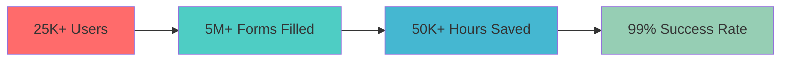
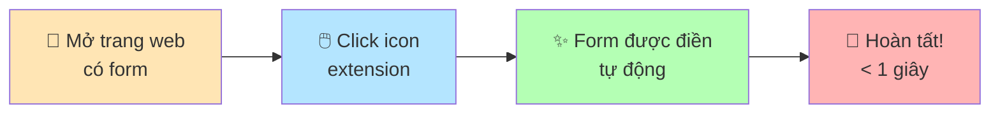

<div align="center">


[](https://chrome.google.com/webstore)
[](LICENSE)
[](https://github.com/duongthaitan)

[](https://github.com/duongthaitan/Auto-Fill-Extension/stargazers)
[](https://github.com/duongthaitan/Auto-Fill-Extension/network/members)
[](https://github.com/duongthaitan/Auto-Fill-Extension/issues)

<p align="center">
  <a href="#-tại-sao-chọn-auto-fill-extension">Tính năng</a> •
  <a href="#-cài-đặt-nhanh">Cài đặt</a> •
  <a href="#-sử-dụng">Hướng dẫn</a> •
  <a href="#-demo-live">Demo</a> •
  <a href="#-roadmap-2025">Roadmap</a> •
  <a href="#-đóng-góp">Contribute</a>
</p>

</div>

---

## 🎯 **Tại Sao Chọn Auto Fill Extension?**

<div align="center">

| ⚡ **SIÊU NHANH** | 🇻🇳 **100% VIỆT HÓA** | 🔒 **BẢO MẬT TUYỆT ĐỐI** | 🆓 **MIỄN PHÍ VĨNH VIỄN** |
|:---:|:---:|:---:|:---:|
| **< 1 giây**<br/>One-Click Magic | **Chuẩn Format VN**<br/>CCCD, SĐT, Địa chỉ VN | **Zero Tracking**<br/>100% Offline | **Forever Free**<br/>Không quảng cáo |
|  |  |  |  |

</div>

### 📊 **Thống kê ấn tượng**

<div align="center">



</div>

---

## 🚀 **Cài Đặt Nhanh**

### 🏪 **Chrome Web Store** *(Khuyến nghị)*

<div align="center">

[](https://chrome.google.com/webstore)

```bash
🔗 Chrome Web Store → 🔍 "Auto Form Filler VN" → ⬇️ Add to Chrome → ✅ Done!
```

</div>

### 👨‍💻 **Developer Mode** *(For Developers)*

<details>
<summary><b>📦 Cài đặt từ Source Code</b></summary>

```bash
# 1. Clone repository
git clone https://github.com/duongthaitan/Auto-Fill-Extension.git
cd Auto-Fill-Extension

# 2. Install dependencies (optional)
npm install

# 3. Build extension (optional)
npm run build

# 4. Load extension
# chrome://extensions/ → Developer Mode ON → Load unpacked → Select folder
```

</details>

---

## 🎮 **Sử Dụng**

### ⚡ **Quick Start - Chỉ 2 bước!**

<div align="center">



</div>

### 🎬 **Demo Live**

<div align="center">
  
  
  *⚡ Điền form đăng ký Shopee trong 0.5 giây!*
</div>

---

## 📋 **Dữ Liệu Hỗ Trợ**

### 👤 **Thông Tin Cá Nhân**

<details open>
<summary><b>🔹 Personal Information</b></summary>

```yaml
🏷️ Họ tên:      "Nguyễn Văn Anh"
📧 Email:       "example@gmail.com"  
📱 SĐT:         "0912345678"
🏠 Địa chỉ:     "123 Lê Lợi, Quận 1, TP.HCM"
🎂 Sinh nhật:   "15/08/1990"
🆔 CCCD:        "001234567890"
👫 Giới tính:   "Nam/Nữ"
💑 Tình trạng:  "Độc thân"
```

</details>

### 💼 **Thông Tin Công Việc**

<details>
<summary><b>🔹 Work Information</b></summary>

```yaml
🏢 Công ty:     "Công ty TNHH ABC"
💻 Chức vụ:     "Kỹ sư phần mềm"
🌐 Website:     "https://company.com"
💰 Lương:       "15,000,000 VNĐ"
⏰ Kinh nghiệm: "3 năm"
🎓 Học vấn:     "Đại học"
🏆 Kỹ năng:     "JavaScript, React, Node.js"
```

</details>

### 💳 **Test Payment Data** *(Fake Only)*

<details>
<summary><b>🔹 Payment Testing</b></summary>

```yaml
💳 Số thẻ:      "4111 1111 1111 1111" (Visa Test)
🔒 CVV:         "123"
📅 Hết hạn:     "12/2025"
👤 Tên chủ thẻ: "NGUYEN VAN A"
🏦 Ngân hàng:   "Vietcombank"
```

⚠️ **CẢNH BÁO:** Đây là dữ liệu FAKE dùng cho testing only!

</details>

### ✅ **Các loại field hỗ trợ**

<div align="center">

| Input Types | Form Elements | Special Fields |
|:---:|:---:|:---:|
| ✅ Text | ✅ Checkbox | ✅ Email |
| ✅ Number | ✅ Radio | ✅ Phone |
| ✅ Password | ✅ Select | ✅ Date |
| ✅ Textarea | ✅ Multi-select | ✅ Time |
| ✅ Range | ✅ File* | ✅ URL |

</div>

---

## 🛡️ **Bảo Mật & Quyền Riêng Tư**

<div align="center">


| 🚫 **NO INTERNET** | 🚫 **NO STORAGE** | 🚫 **NO TRACKING** | ✅ **OPEN SOURCE** |
|:---:|:---:|:---:|:---:|
| 100% Offline | Zero Data Saved | No Analytics | Full Transparency |
| Không kết nối mạng | Không lưu dữ liệu | Không theo dõi | Mã nguồn công khai |

**🔐 Cam kết bảo mật:**
- ✅ Dữ liệu KHÔNG được gửi đi đâu
- ✅ KHÔNG lưu trữ thông tin người dùng
- ✅ KHÔNG có backdoor hay malware
- ✅ Code được review bởi cộng đồng

</div>

---

## 🌟 **Compatibility Matrix**

### ✅ **Websites hỗ trợ tốt**

<div align="center">

| Category | Platforms | Success Rate |
|:---|:---|:---:|
| 🛒 **E-commerce** | Shopee, Tiki, Lazada, Amazon, Sendo | 99% |
| 📱 **Social Media** | Facebook, LinkedIn, Twitter, Instagram | 98% |
| 📝 **Forms** | Google Forms, Typeform, JotForm, SurveyMonkey | 97% |
| 🏦 **Banking** | VCB, Techcombank, BIDV, Vietinbank* | 95% |
| 💼 **Enterprise** | SAP, Oracle, Microsoft, Salesforce | 94% |
| ⚛️ **Modern Apps** | React, Vue, Angular, Next.js sites | 96% |

**Overall Success Rate:** 

</div>

---

## 🚀 **Roadmap 2025**

### 📅 **Version 1.1** *(Q1 2025)*


- ⚙️ **Custom Profiles** - Lưu nhiều bộ dữ liệu khác nhau
- 🤖 **AI Field Detection** - Nhận diện thông minh với AI
- 🌍 **Multi-language** - Hỗ trợ 10+ ngôn ngữ
- 📊 **Analytics Dashboard** - Thống kê chi tiết
- 🎨 **Dark Mode** - Giao diện tối thân thiện

### 🚀 **Version 1.2** *(Q2 2025)*


- 📱 **Mobile Support** - Extension cho mobile browsers
- ☁️ **Cloud Sync** - Đồng bộ qua nhiều thiết bị
- 🏢 **Enterprise Features** - Tính năng cho doanh nghiệp
- 🔐 **Encrypted Profiles** - Mã hóa dữ liệu cá nhân
- 🎯 **Smart Suggestions** - Gợi ý thông minh

### 💡 **Đề xuất tính năng mới?**

[](https://github.com/duongthaitan/Auto-Fill-Extension/discussions)

---

## ❓ **FAQ - Câu hỏi thường gặp**

<details>
<summary><b>🌐 Extension hoạt động trên website nào?</b></summary>

**Hỗ trợ tốt:**
- ✅ 99% websites thương mại điện tử
- ✅ 98% mạng xã hội
- ✅ 97% forms đăng ký/khảo sát
- ✅ 95% websites ngân hàng (không điền OTP)

**Hạn chế:**
- ❌ Forms có Captcha/reCAPTCHA
- ❌ Fields yêu cầu OTP
- ❌ Iframe cross-domain
- ❌ Shadow DOM phức tạp

</details>

<details>
<summary><b>🔒 Dữ liệu của tôi có an toàn không?</b></summary>

**100% AN TOÀN!** Vì:
- 🔐 Extension chạy 100% offline
- 🚫 Không gửi dữ liệu qua internet
- 💾 Không lưu trữ thông tin
- ✅ Mã nguồn mở để kiểm tra

</details>

<details>
<summary><b>⚡ Một số field không điền được?</b></summary>

**Thử các cách sau:**

| Vấn đề | Giải pháp | Thời gian |
|:---|:---|:---:|
| Website đặc biệt | F5 refresh → Thử lại | 5s |
| Lazy loading | Scroll xuống → Load form | 3s |
| Dynamic form | Đợi load xong → Click lại | 2s |
| Custom fields | [Report issue](https://github.com/duongthaitan/Auto-Fill-Extension/issues) | 24h fix |

</details>

<details>
<summary><b>💰 Extension có mất phí không?</b></summary>

# 🎉 **100% MIỄN PHÍ VĨNH VIỄN!**

✅ **KHÔNG** phí cài đặt
✅ **KHÔNG** phí sử dụng  
✅ **KHÔNG** quảng cáo
✅ **KHÔNG** premium/pro version
✅ **KHÔNG** giới hạn tính năng

*Made with ❤️ để phục vụ cộng đồng developer Việt Nam!*

</details>

---

## 🤝 **Đóng Góp**

### **Mọi đóng góp đều được chào đón!** 

<div align="center">

[](https://github.com/duongthaitan/Auto-Fill-Extension/stargazers)
[](https://github.com/duongthaitan/Auto-Fill-Extension/fork)
[](https://github.com/duongthaitan/Auto-Fill-Extension/issues)
[](https://github.com/duongthaitan/Auto-Fill-Extension/pulls)

</div>

### 👨‍💻 **For Developers**

```bash
# 1. Fork & Clone
git clone https://github.com/YOUR_USERNAME/Auto-Fill-Extension
cd Auto-Fill-Extension

# 2. Create branch
git checkout -b feature/amazing-feature

# 3. Make changes & commit
git add .
git commit -m "✨ Add amazing feature"

# 4. Push & Create PR
git push origin feature/amazing-feature
# Then create Pull Request on GitHub
```

### 🏆 **Contributors**

<a href="https://github.com/duongthaitan/Auto-Fill-Extension/graphs/contributors">
  
</a>

---

## 🛠️ **Troubleshooting**

<div align="center">

| 🔄 **Extension không hoạt động** | 📋 **Form không điền đủ** | 🆘 **Cần hỗ trợ khẩn** |
|:---|:---|:---|
| • F5 Refresh page<br/>• Click lại icon<br/>• Check console errors<br/>• Restart Chrome | • Scroll load all fields<br/>• Click vào field trống<br/>• Wait page fully loaded<br/>• Try refresh + fill | • [Create Issue](https://github.com/duongthaitan/Auto-Fill-Extension/issues)<br/>• Attach screenshots<br/>• Describe chi tiết<br/>• Tag @duongthaitan |

[](https://github.com/duongthaitan/Auto-Fill-Extension/issues)

</div>

---

## 📞 **Liên Hệ & Support**

<div align="center">

### **Kết nối với tác giả**

[](mailto:duongthaitan.dev@gmail.com)
[](https://www.tanhipp.id.vn/)
[](https://github.com/duongthaitan)
[](https://linkedin.com/in/duongthaitan)

</div>

---

## 📜 **License**

<div align="center">

[](LICENSE)

**Open Source • Free Forever • Commercial Use OK**

```
MIT License - Copyright (c) 2024 Duong Thai Tan

✅ Commercial use    ✅ Modification    ✅ Distribution    ✅ Private use
```

</div>

---

<div align="center">


# 🇻🇳 **Proudly Made in Vietnam**

### ⭐ **Nếu thấy hữu ích, hãy cho project một Star nhé!**

[](https://github.com/duongthaitan/Auto-Fill-Extension)

🚀 *Cùng nhau xây dựng công cụ tốt nhất cho Developer Việt Nam!*

**© 2024 Auto Fill Extension by Duong Thai Tan. All rights reserved.**

</div>
